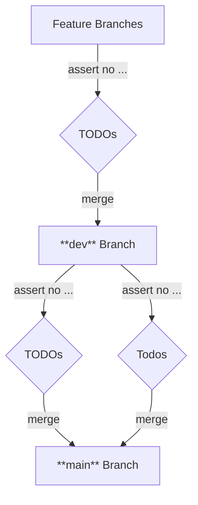

# hooks-utility

a collections of utility functions for **git hooks**

## Installation

<!-- TODO installation instructions -->

enable git hooks:

```bash
git config core.hooksPath scripts/hooks
```


## Functionality

### log message


### annotation marker (AM) check


