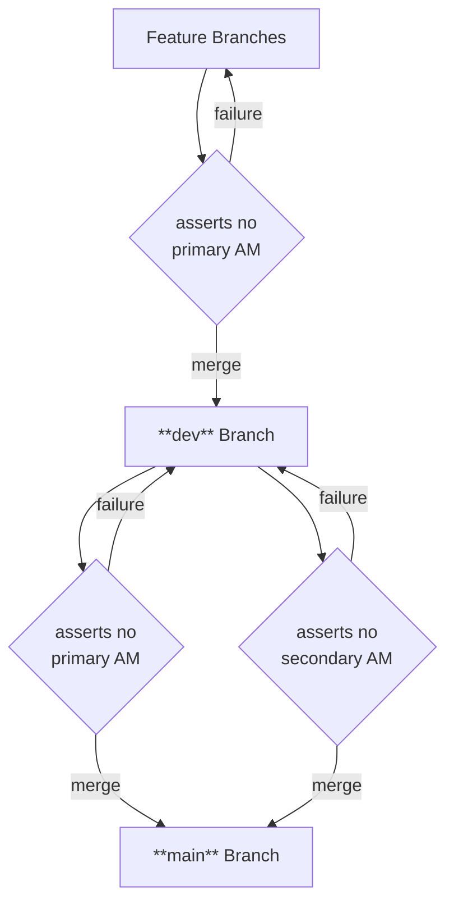

# hooks-utility README

a collections of utility functions for **git hooks**


## Installation

Use `hooks_utility.sh` by place it alongside git hooks scripts.

Typical folder structure:

```
.
└── scripts
    └── hooks
        ├── hooks_utility.sh
        ├── pre-merge-commit
        └── ...
```

And in the git hook scripts (e.g. `pre-merge-commit` above,)
**source** the `hooks_utility.sh`:

```bash
source "$(dirname "${BASH_SOURCE[0]}")/hooks_utility.sh"
```


## Functionality

### log style message

Print log style message (i.e. prefixed with `DEBUG`, `ERROR`, ...)
to `stdout` or `stderr`, using these 5 functions, e.g.:

```bash
hooks_utility_debug "Debug Message Content"
hooks_utility_warning -dt "Warning Message Content" "hooks_utility.sh"
```

Outputs:

```
DEBUG:  Debug Message Content
[2025-10-12 16:23:16]WARN (hooks_utility.sh):   Warning Message Content
```


### merging annotation marker (AM) check

Todo write simple docs


