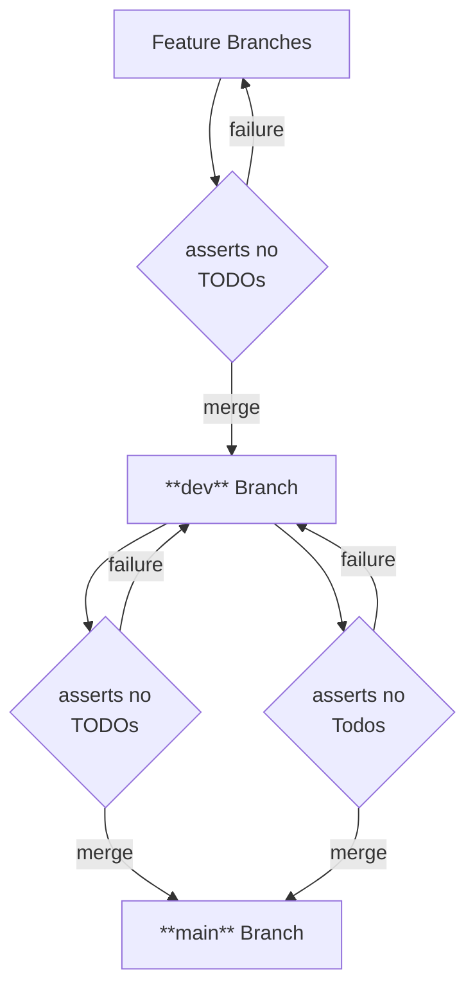

# hooks-utility README

a collections of utility functions for **git hooks**

<!-- todo installation instructions -->

<!-- ## Installation

enable git hooks:

```bash
git config core.hooksPath scripts/hooks
```


## Functionality

### log message

-->


### merging annotation marker (AM) check

<!-- 

Annotation markers:

- `TODO`s, `BUG`s, `FIXME`s, `HACK`s:
- `Todo`s, ...:
- `todo`s, ...: -->


